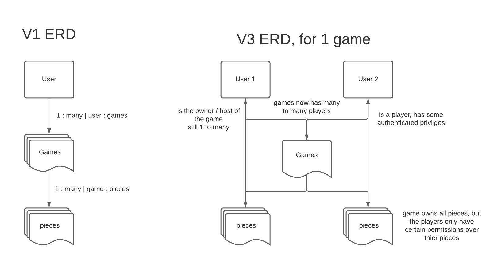

<!-- Read me file -->

## Welcome to Andrews Advance War Game API!  
*game title pending*

This is my current in-progress passion project and part 2 of my final project for the General Assembly Software Engineering program. 
My goal with this application is to make a game inspired by the classic Advanced Wars games for the Game Boy Advanced from 2001 and 2003. These were some of my brothers favorite games and I hope to share this with them so that we can play together online when it is finished. 

This part of the application is a backend API built with Django, designed to be used with the frontend React application. 

Currently, the models are all in a V1 state. Developing this part of the application has been a real struggle and a major learning process as this is my first django project. 
Some major hurdles where determining how I should define the relationships between my models, and how to represent them in the serializer(s). A major bug I had while developing this V1 was due to having the serializer used in the create view using another serializer for the game's pieces. I also ran into a lot of difficulty writing custom methods for my models, which was logic I ultimately decided to move to the front end application. 
One of my biggest area's for personal growth as a developer is sticking to V1 at the beginning of a project, and I quickly found I was writing V2 piece models before even testing V1 CRUD. This really did me no favors and had to be rolled back when I ran into the above issues. The code is currently in the graveyard of zombie code in this repository waiting ot be resurrected.
Despite the relatively sloppy and slow development of this api, it was an invaluable learning experience with many lessons learned, django and otherwise. If I could go back I would make sure I stayed extra focused on achieving V1 requirements and having them clearly defined before thinking about how to implement the rest of the functionality of V2 and V3. 

The next steps for this repository is to start expanding the game and piece models as I begin to implement V2 game mechanics, like player resources, move distance, attack damage, hit points etc... 
After V1 features are fully completed on the front end.

---

#### Links:
  * Deployed Site: https://kestler01.github.io/react_advanced_war_client/

  * Client Repo: https://github.com/kestler01/react_advanced_war_client/settings/pages

  * API Repo: https://github.com/kestler01/django_advanced_war_api

---

#### Technologies used:
  * Django
  * Presql
  * Python
  * postman 
  * pipenv

---

#### ERD:

---

#### V1 ScreenShots:
HomePage

GameHall

GameBoard

 > due to the size of the screen, the navbar was cut off at the time, it is still at the top of the page in the game board view. 

---

#### Routes:
The routes are designed to be as restful as possible which can be difficult when thinking about game mechanics. 

URI Pattern  |	Verb
------------ | -------------
sign-up | post
sign-in | post

Authenticated routes:
URI Pattern  |	Verb	Verb   | Description
------------ | ------------- | --------------------------
sign-out | delete | deletes user token
change-pw | patch | takes old password an new one, checks data and stores new hashed password
games | get | index games, currently only owned games
games | post | create a game, requires a name
games/:id/ | get | get the one game and it's details
games/:id/ | delete | delete the game, wil also delete it's pieces
games/:id/ | patch | partial update of the game, will not change owner
games/:id/pieces | get | index the games pieces, data also included in previous view, but this doesn't return the games data
games/:id/pieces | post | create a new piece
games/:id/pieces/:id | get | get the one piece ans it's details
games/:id/pieces/:id | delete | delete the piece
games/:id/pieces/:id | patch | partial update of the piece

---
<!-- 
#### Installation Instructions:
Want to use this repository as a template for your own application? 
Start by forking and cloning this repository to your own github and remote environment.
inside your remote environment -->
